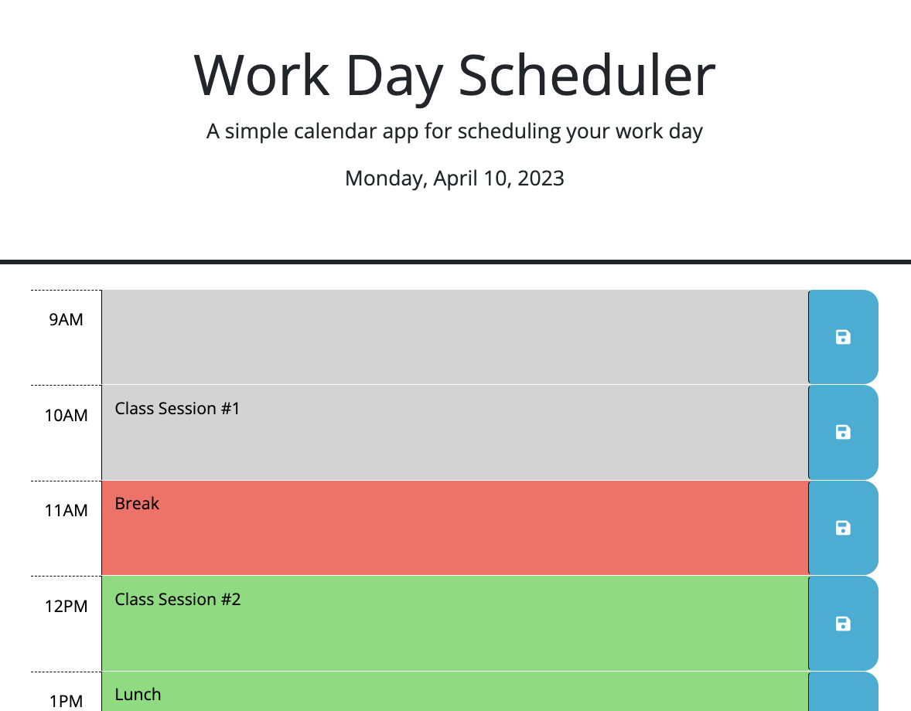

# umn-edx-work-day-scheduler

## SUMMARY
This is a simple day planner that allows you to set events for the whole work day.  This is based upon hour and when each event is saved (individually), it is retained and displayed when the page is reloaded.

## NOTES
The data is stored in your browser's local storage, so data saved on one browser or machine will not be accessible from another.

The day's events are saved and stored based upon date so that only the current day is displayed.  This is to prevent events from multiple days to be displayed at once.

At present there is no feature within the app to view or edit other days.  There are also no means of purging old data at the moment.  These could easily be added at a later time.

## LIVE VIEW
The scheduler can be viewed here: https://thinkbui.github.io/umn-edx-work-day-scheduler/

